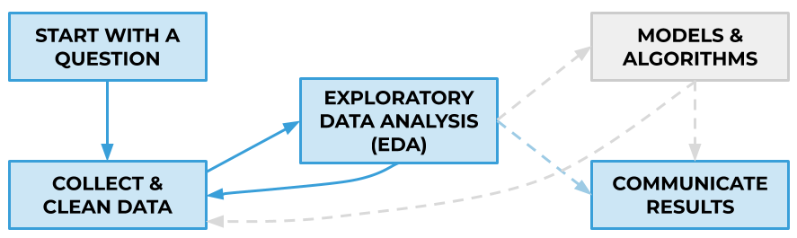
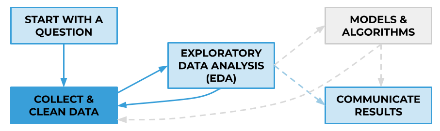
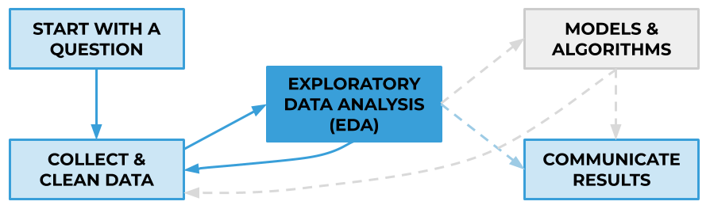

## Exploratory Data Analysis Project Workflows

These workflows should be viewed as **helpful guiding frameworks** rather than an exact prescription of what to do and the order to do it in. Guidelines are helpful, but they must be combined with good judgment (enhanced through experience) in order to complete successful projects.

### The Data Science Workflow
As will be introduced in the [Data Cleaning lesson](../data-cleaning), a data science project typically consists of five main steps:
1. Start with a question
2. Collect and clean data
3. Exploratory data analysis (EDA)
4. Models & algorithms
5. Communicate results

Sometimes, we perform EDA to better understand our data in preparation for further modeling and algorithms. Other times, our goal is to identify patterns and trends in the data through exploratory analysis, and we directly communicate the useful/actionable insights extracted from EDA as our end product. 

---
---

### How to collect and clean a data set

**1. Scope out the data science problem and the target dataset**

The data science workflow starts with a question, so clarify the problem you'd like to solve before touching the data:
- What is the problem you'd like to solve, i.e., what is the purpose of doing this EDA project? 
- What are you hoping to learn?
- What dataset could be used to find what you hope to learn?

Take a look at your target dataset and determine how well it meets your needs:
- What is the dataset? 
- What columns/features are available? 
- Is the data sufficient to address your EDA problem, or will you likely need supplemental data?
- What subset of the data do you actually need, e.g., a particular region, time period, department, etc.?
  
 
**2. Extract the dataset**  

Most companies store their data in SQL databases, so the next step in the workflow is to use SQL to:
- Preliminarily explore the available data using [basic](../sql-1) and [advanced](../sql-3) queries
- Combine [multiple tables](../sql-2) if necessary
- Use [SQLAlchemy](../sql-2) to extract the relevant data into Python for further cleaning and manipulation using [pandas](../pandas-1)

Note that for the purposes of the [EDA project](../project-introduction), you will also need to perform the initial step of loading the raw data into a SQL database.

**3. Clean the data**  

Real world data is messy, so the goal of this step is to get your data into a usable format for further exploration and modeling (if applicable). As will be covered in the [data cleaning lesson](../data-cleaning), this includes but is not limited to:
- Removing duplicate or unnecessary data
- Fixing inconsistencies and typos
- Dealing with outliers and missing data

---
---

### How to explore a data set

EDA is useful because it allows you to:
- Get an initial feel for the data
- See if the data makes sense and if further cleaning or more data is needed
- Identify patterns and trends in the data - often these can be just as important as your findings from modeling
 
There is no single correct way to explore a dataset, but two main categories of techniques are:

**1. Calculating summary statistics**  

Summary statistics help to characterize your data in a quantitative way. 

To summarize **a single numerical feature**, you can calculate the mean, median, mode, standard deviation, minimum and maximum values, etc. To summarize **a single categorical feature**, you can calculate the most common value, the distribution of values, etc. 

To summarize the relationship between any **two numerical features**, you can calculate their correlation coefficient. To summarize the relationship between **a numerical and a categorical feature**, you can calculate the numerical feature's summary statistics (e.g. mean, median, etc.) for each unique value of the categorical feature.

You can also calculate these summary statistics for specific subgroups of interest (e.g. a specific region, user, or other entity), or see how they change over time. These summary statistics and many others can be easily calculated using Python packages such as [pandas](../pandas-1) (and more [here](../pandas-2)) and [numpy](../numpy).
    
**2. Creating data visualizations**  

Data visualizations are immensely useful as part of the EDA process because they capture attributes of and relationships between features in a visually-interpretable way. They can often communicate numerical information much more quickly, accessibly, and memorably than a numerical table equivalent, making them useful to both technical and non-technical stakeholders. They may provide interesting insights in and of themselves, and may also suggest areas worthy of further exploration. Visualizations can also help to identify irregularities or errors that must be addressed through further cleaning. 

Common visualizations that you can create include:
- Histograms
- Bar charts
- Line charts
- Scatter plots
- Box plots
- Pair plots
- Heat maps
- And many more

The most widely-used Python tools for data visualization are [matplotlib](../matplotlib) (for basic visualizations) and [seaborn](../seaborn) (for more advanced visualizations).

---

**Other considerations and subtleties**   

* **Iterative process**: It is rare for the data cleaning and exploration steps to be completed linearly. Instead, as highlighted in the diagrams above, data cleaning and exploration typically occur in tandem, in an iterative manner. As you explore the data in more detail, you often find new things that need to be cleaned. The exploration step can also better inform your strategy for dealing with outliers and missing data. 

* **Communicating EDA results**: The results of an EDA project must be communicated in a way that supports the initial data science problem that it was designed to address. The audience (your team, boss, client, etc.) doesn't want to see every single summary statistic that you calculated or every data visualization that you created. Use your judgment as a data scientist to extract the portions of your analysis that tell a story and convey the insights you learned in a concise, compelling way.

