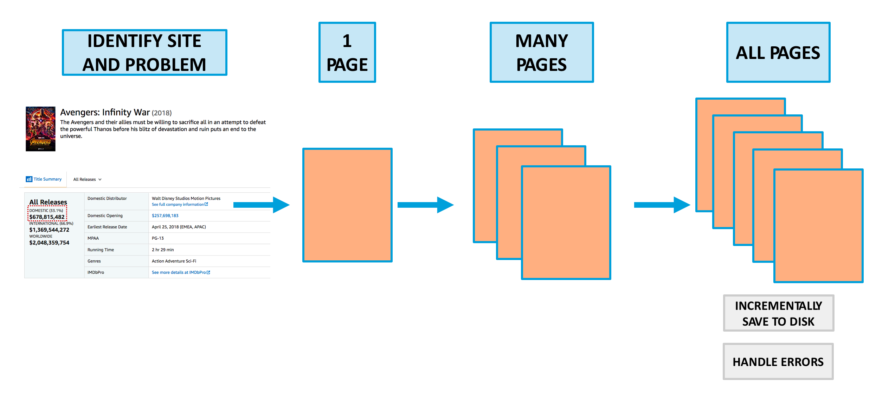
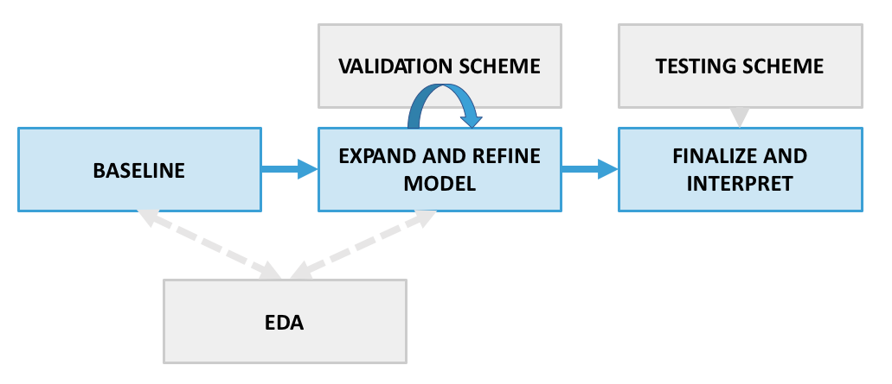

## Scraping and Regression Project Workflows

These workflows should be viewed as **helpful guiding frameworks** rather than an exact prescription of what to do and the order to do it in. Guidelines are helpful, but they must be combined with good judgment (enhanced through experience) in order to complete successful projects.

---
---

### How to build a web scraping pipeline

**1. Scope out the data science problem and the target site**

 Exploring the site, carefully define what an observation/row will be in your final data (features and target), making sure it corresponds well with the structure of the site and the information accessible (visually). Ideally, do some preliminary research into the viability of scraping the site -- look at its robots.txt, see if others have scraped it successfully, and even try sending the site a series of requests to make sure there isn't severe rate limiting. 

**2. Develop code to scrape 1 page**

 Be able to scrape the observation data for a single page, storing the data in a python data structure such as a dictionary. Make sure the data is captured correctly (precise cleaning can be handled later). Err on the side of obtaining more features than you need, since you may find a use for these later and want to avoid having to rerun your entire pipeline from scratch later on. 

 Refer to the [BeautifulSoup notebook](../web-scraping-beautifulsoup/) to see the standard scraping approach (for static page data). If you need to interact with the website more and the data is more dynamic (e.g. there's javascript, you need to scroll on the page etc.), you will probably need to use [Selenium](../web-scraping-selenium/). 

**3. Scale to scraping many pages**

 Be able to scrape data for many observations across a collection of pages, storing the data in a Python data structure -- a Pandas dataframe is probably ideal, and it may be easiest to create a dataframe directly from a list of dictionaries that would be created by step 2. Check again for data correctness, going back to step 2 as needed to adjust your scraping code to handle new cases that come up.  

**4. Incorporate error handling and execute pipeline to scrape all pages**

 * **Collect all destinations**: collect a complete list of page urls you need to scrape (this may be easiest to do from a quick scrape of a summary list of pages on the website) or come up with a strategy for iteratively visiting all the pages (e.g. replace consistently formatted urls with new numbers or write selenium code to click a next page button).
* **Incrementally save**: write code that tracks your progress and periodically saves the dataframe created so far to a .csv or .pkl file (e.g., every 1000 records using (i+1) % 1000 == 0), with a filename that notes the progress (e.g. my_movies_0-999.csv, my_movies_1000-1999.csv, etc.). This will ensure that if your code breaks, you lose much less progress. It also lets you access preliminary data for EDA/modeling much more quickly, while the rest of your scraping pipeline finishes executing.
* **Handle rate limiting and code errors**: write logic to pause then resume scraping if rate limiting is triggered and/or periodically pause to avoid rate limiting (see [scraping the unscrapable](../web-scraping-selenium/advanced_scraping.ipynb) for more detail). Also write logic to catch page scraping errors, logging the problematic pages to make it easier to identify and fix errors. 

---
---

### How to build and test a linear regression model

**1. Exploratory data analysis**

 * **Look at, summarize, and clean the data**. Examine at least some rows in micro detail, checking that the data is correct and appears as you expected (e.g., number of customers should not be negative!). Also study the macro level by aggregating the data and looking at summary information and statistics (what is the data type, how many entries and missing values are there, what are some descriptive statistics such as mean for numerical columns, etc.) Significant preprocessing/data preparation may be called for in cases of messy/problematic data.
* **Scope out regression viability**: Look at key statistics and visualizations related to regression assumptions -- correlation matrix, target distribution, target vs. feature plots (e.g. seaborn pairplot). Get some initial expectations for model performance and identify features that intuitively, visually, and based on correlation with the target are likely to work well.    

Note the diagram's suggested nuance in how EDA fits into the regression workflow: it's typical to constantly return to EDA for further cleaning and feature exploration as you build understanding and evidence in the modeling portion of the workflow. 

**2. Baselining** 

 Build a [linear regression model](../linear-regression-code-intro/) using a small handful of features; you might even get lucky and be able to explain your targets with very few features. Start with features that are most likely to be predictive based on your domain knowledge and EDA (step 1) and/or are simple to handle (e.g. numeric without null values). Calculate some [model evaluation metrics](../linear-regression-evaluation/) such as R^2 to get a baseline score and a feel for how well the model can perform. deally, calculate the baseline score on a hold out set as in part 3, not the training data.

**3. Establish a validation and testing scheme**

 Set up a data splitting structure for [validating and testing your model](../cross-validation). Cross-validation will often be preferable to simple, single-set validation due to its robustness There may also be cases where a specialized validation setup is called for, such as in [time series](../time-series) problems. Using your chosen validation scheme, you can perform iterative feature selection/expansion/engineering and model complexity adjustments in order to complete the next 2 steps. You will use the test data only once your model is finalized in order to compute a final estimate of generalization performance.

**4. Expand and refine model** 

 Starting from the baseline and in an iterative, validated loop, continue to ask: do you need [more complexity or less ](../bias-variance) (underfitting vs. overfitting)? Do you need a fancier, more complex model (nonlinear, additional [feature engineering](../feature-engineering-regression) / transformations e.g. polynomial)? Or instead are you overfitting and need to make your model more conservative by removing features or using [regularization](../regularization)? Hopefully you can quickly acquire an understanding of which direction you need to go from your baseline and early modeling results, then make more fine-tuned changes as you go.

 The impact of model choices should be consistently measured against the same validation data as in part 3, using relevant regression performance metrics such as R^2 or mean absolute error. The [feature engineering lesson](../feature-engineering-regression) provides a model for how you might track your progress while iteratively expanding your model. Linear regression [assumption testing and diagnostics](../linear-regression-assumptions) are another valuable tool for understanding the issues your model has and how it might be improved -- it can be helpful to use these as part of your iterative improvement process as well. For instance, residual and/or Q-Q plots can help identify when a model is poorly specified and may benefit from additional features or feature transformations (e.g. a clear linear pattern in residuals could point to a quadratic polynomial regression being a better fit).         

**5. Finalize, test, and interpret your model** 
* **Finalize and test**: when satisfied with the results of your tuning in step 4, establish your final model choices (features, preprocessing, and hyperparameters) and retrain this model on all training + validation data. Make predictions on the test data and score these predictions, reporting this score as your estimate of the model's generalization performance.   

* **Interpret**: extract and study your final model coefficients. Are there any interesting or unexpected takeaways? How do the model coefficients align with your intuition and domain knowledge about the problem? Be careful about complicating factors in interpretation such as differing feature scales and multicollinearity. It may be helpful to look at p-values for coefficients (e.g. using the statsmodels package) along with other model assumption diagnostics such as residual plots and normality tests in order to explore the statistical evidence around your findings.        

---

**Other considerations and subtleties**

 There are many complex choices and tradeoffs that go into model design, and the above framework makes some assumptions including reasonably small data and prediction-focused model goals. In real world projects, some considerations that may impact/change the steps above include:

* **Data scale**: with larger data sets (e.g. 10 million+ records), it's typically more practical to perform baselining (step 2) and model selection (step 4) on a representative subset of the data rather than all of it. This is less resource (RAM) intensive and less time consuming, so will almost always be best practice.

* **Predictive vs. interpretive model goals**: in many projects, understanding the problem and its driving feature/target relationships in a clear way competes for importance with pure predictive performance. A simpler model with a few key, statistically significant features that can be easily explained to stakeholders can have much more business value than a complex model with a marginally improved R^2. This can have a very significant impact on the process and choices made in step 4 (e.g. adding too many features or polynomial terms may harm the project goals, even if R^2 goes up). It's always best to establish a **clear sense of model purpose** and think about how to navigate these tradeoffs in advance, so that you don't fall into the trap of prioritizing score above all else. Note that in some cases, a compromise available is to train multiple models with their own emphasis -- e.g. one focused on prediction, one focused on interpretation.

* **Model scalability, speed, and maintainability**: when models are deployed as part of a live application, it can be critical that they make predictions quickly and are easy to recurrently update. This can place limitations on the scope of model complexity, the types of features used, etc. that can have a big impact on the model choices made in step 4 and also add an application/engineering performance testing element to step 5.      
