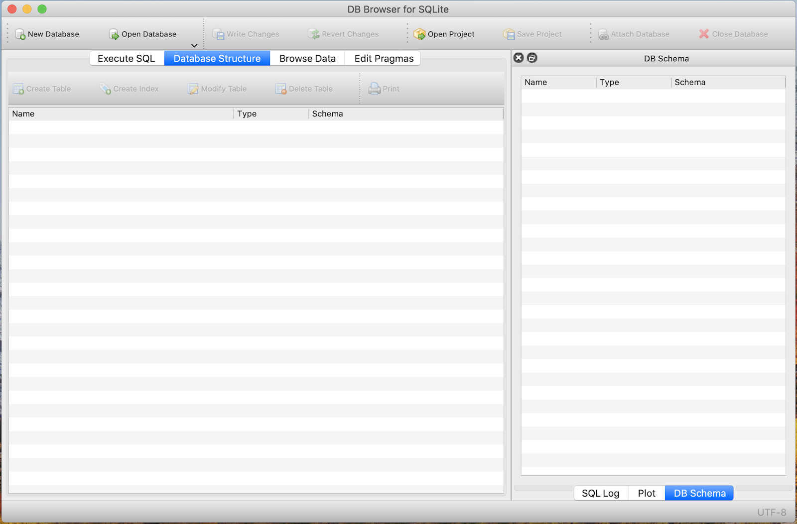
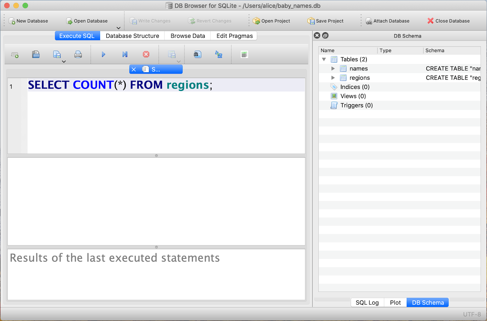

# SQLite Setup
The goal of this exercise is to get you set up in both SQLite and DB Browser for SQLite. We will be going through the following steps:
* Download the baby names database
* Install SQLite and run a simple SQL query
* Install DB Browser for SQLite and run a simple SQL query

### Step 1: Download the baby names database

Download the baby_names.db file onto your computer from [this link](https://metis-curriculum-development.s3.amazonaws.com/baby_names.db).  

### Step 2: Install SQLite and run a simple SQL query

**MacOS Installation**

If you are on MacOS, SQLite comes preinstalled on your computer.

Open up the Terminal application. Navigate to the Downloads folder where you’ve downloaded baby_names.db.

`cd Downloads`

You are now ready to launch SQLite.

**Windows / Linux Installation**

If you are on Windows or Linux, go to the [SQLite Downloads](https://www.sqlite.org/download.html) page and download 
the sqlite-tools-win32-x86-3330000.zip file or sqlite-tools-linux-x86-3330000.zip file depending on your operating system.

In your Downloads folder, you should now see a folder called sqlite-tools-win32-x86-3330000 or sqlite-tools-linux-x86-3330000.

You downloaded baby_names.db in the previous step. Move the baby_names.db file into the sqlite-tools-win32-x86-3330000 or sqlite-tools-linux-x86-3330000 folder.

Open up the Command Prompt application. Navigate to the sqlite-tools-win32-x86-3330000 or sqlite-tools-linux-x86-3330000 folder.

`cd Downloads sqlite-tools-win32-x86-3330000
`
You are now ready to launch SQLite.

**Run a simple SQL query**

Within either the Terminal on MacOS or the Command Prompt on Windows / Linux, open up the baby names database in SQLite.

sqlite3 baby_names.db

At this point, you should see the sqlite prompt and you have successfully opened up SQLite.

`sqlite>`

Type the following SQL query exactly (including the semicolon) to confirm the number of rows in the names table.

`SELECT COUNT(*) FROM names;`

How many rows are in the names table?

### Step 3: Install DB Browser for SQLite and run a simple SQL query

Go to the [DB Browser for SQLite Downloads](https://sqlitebrowser.org/dl/) page and follow the installation instructions 
for your particular operating system.

Once installed, double click on the DB Browser for SQLite icon to open up the application on your computer. 
Note: On MacOS, you may get an error message saying that the application can’t be opened because Apple cannot check it 
for malicious software. To resolve, right click on the DB Browser for SQLite icon and click Open instead.

Once opened, at the top of the application, you’ll see an Open Database button. Click on the button and navigate to the baby_names.db file.

You are now in the baby names database in DB Browser for SQLite and ready to write SQL queries.

Go to the Execute SQL tab near the top of the application. Within the window, type the following SQL query to confirm 
the number of rows in the regions table. Click on the triangle button to run the query.

`SELECT COUNT(*) FROM regions;`

How many rows are in the regions table?

You have now successfully done the following:
1. Download the baby names database
2. Install SQLite and run a simple SQL query
3. Install DB Browser for SQLite and run a simple SQL query

These are prerequisites for future SQL pairs. Going forward, we highly recommend that you use DB Browser for SQLite to write SQL queries.
